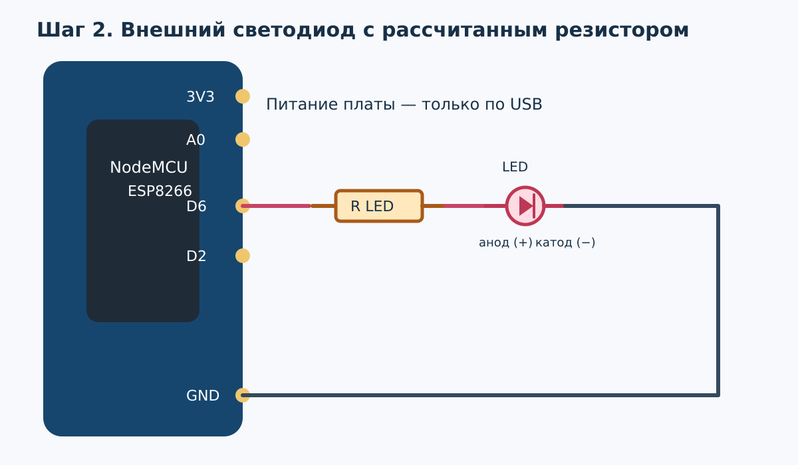
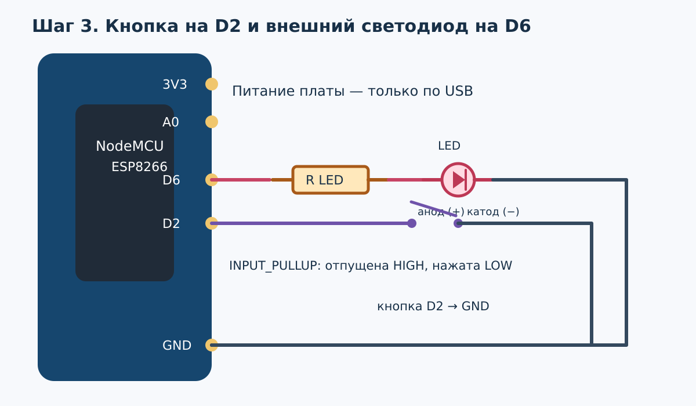
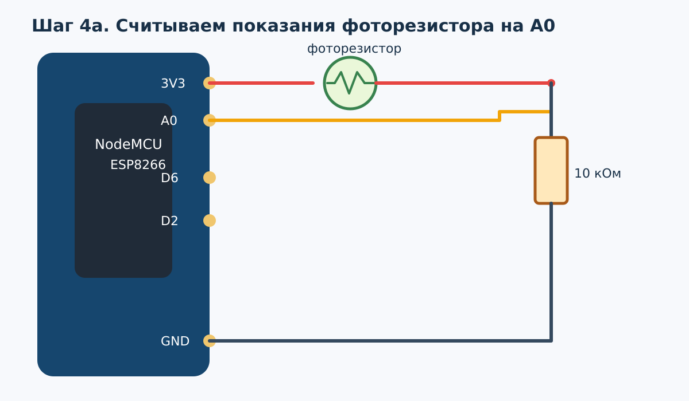
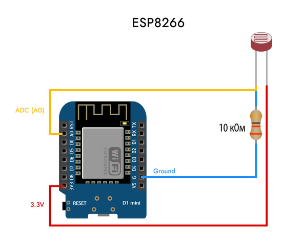
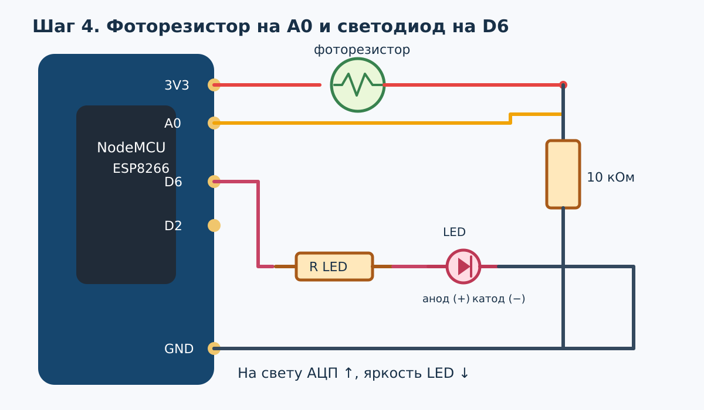
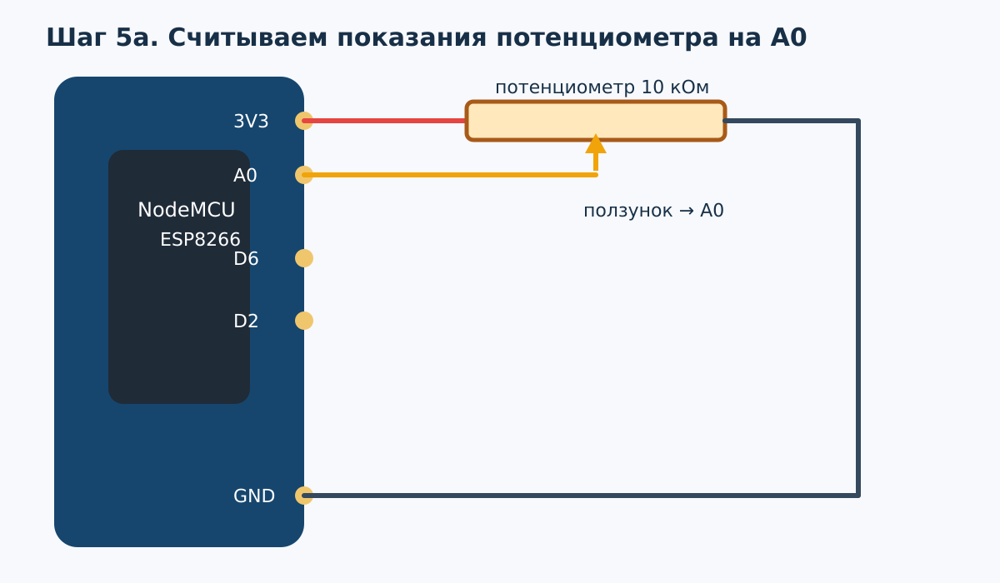
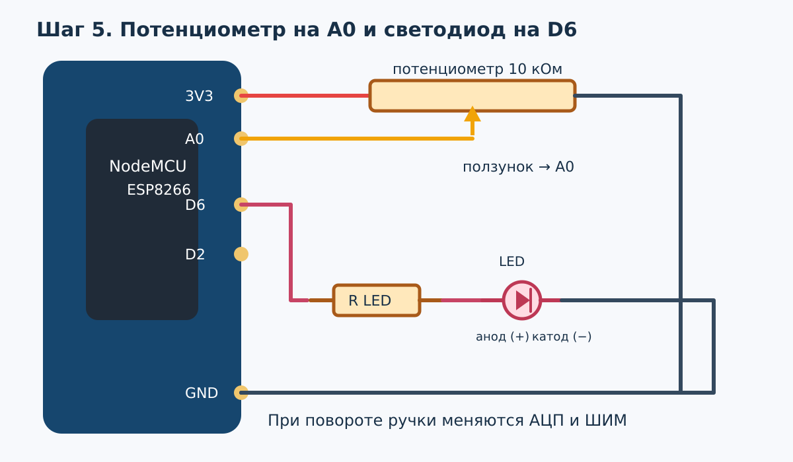
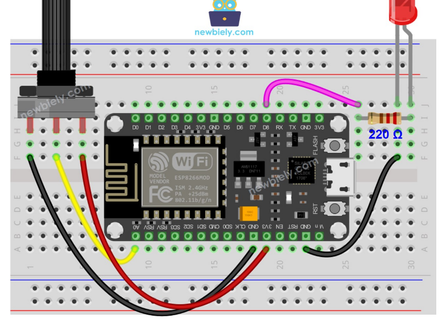
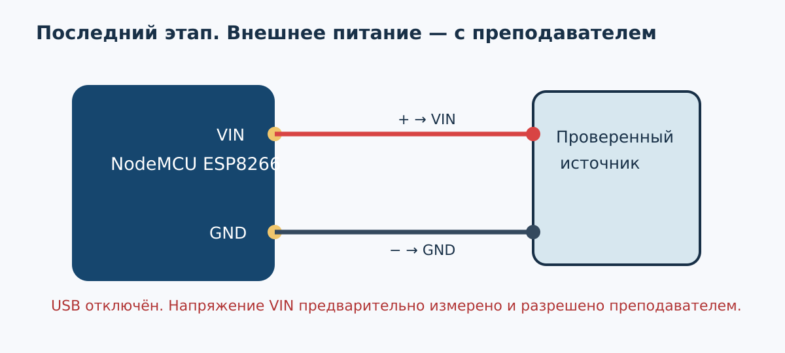

# Лабораторная работа № 2. ESP8266: светодиод, кнопка и аналоговые датчики

Работайте с платой NodeMCU ESP8266, выданной преподавателем. Последовательность: настройка Arduino IDE → встроенный светодиод → подбор резистора и внешний светодиод → кнопка → показания фоторезистора → яркость от фоторезистора → показания потенциометра → яркость от потенциометра → один из 15 вариантов → внешний источник питания **вместе с преподавателем**.

Схемы подключений находятся в папке `images` этого репозитория.

Все сборки и загрузка скетчей до последнего этапа выполняются при питании платы **только от USB**. Меняйте соединения после отключения USB. Схемы ниже показывают электрические связи; перед включением сверьте их с маркировкой своей платы и расположением дорожек макетной платы. Четыре исходных изображения настройки и характеристик светодиодов сохранены в тексте.

---

## 1. Установка и настройка Arduino IDE

Установите актуальную версию **Arduino IDE 2** с [официального сайта Arduino](https://www.arduino.cc/en/software/). Если программа уже установлена, повторно устанавливать её не нужно: проверьте только поддержку ESP8266, модель платы и последовательный порт.

**Для нашей аудитории:** при загрузке установщика Arduino IDE и установке пакета плат ESP8266 может понадобиться VPN. Подключите разрешённый преподавателем VPN **до начала загрузки**, затем откройте страницу Arduino и Менеджер плат. Если пакет не скачивается, сначала проверьте соединение и повторите установку при включённом VPN; не меняйте адрес пакета на случайные зеркала.

Для добавления ESP8266 откройте **Файл → Параметры** (*File → Preferences*). В поле **«Дополнительные ссылки для Менеджера плат»** (*Additional boards manager URLs*) укажите адрес:

```text
https://arduino.esp8266.com/stable/package_esp8266com_index.json
```

Если в поле уже имеются ссылки, добавьте новый адрес, не удаляя существующие. Нажмите **OK**.

<!-- Исходное изображение № 1. Сохранено на исходном месте. -->


*Рисунок 1 — Настройки Arduino IDE. Это исходный скриншот методички; расположение элементов может немного отличаться в другой версии IDE. Адрес на иллюстрации показан с `http://`, в инструкции выше указан `https://`.*

Далее откройте **Инструменты → Плата → Менеджер плат…** либо воспользуйтесь значком Менеджера плат на боковой панели Arduino IDE 2.

<!-- Исходное изображение № 2. Сохранено на исходном месте. -->


*Рисунок 2 — Открытие Менеджера плат (исходный скриншот). Название платы на рисунке — пример, а не требование к номеру COM-порта.*

В поиске введите `esp8266`. Выберите пакет **esp8266 by ESP8266 Community** и нажмите **«Установить»**. Дождитесь завершения установки.

<!-- Исходное изображение № 3. Сохранено на исходном месте. -->


*Рисунок 3 — Пакет ESP8266. На исходном снимке пакет **уже установлен** (видна кнопка «Удалить»); при первой установке будет кнопка «Установить». Указанная на снимке версия — пример, а не обязательная версия для этой работы.*

Подключите NodeMCU USB-кабелем **с передачей данных**. Выберите **NodeMCU 1.0 (ESP-12E Module)**, если выданная плата соответствует этой модели, и её порт в меню **Инструменты → Плата / Порт** либо в верхнем селекторе IDE.

**Проверка перед программированием:**

1. Уточните модель платы по маркировке на самой плате.
2. Убедитесь, что в «Диспетчере устройств» Windows появился USB–UART-порт. Номер COM произвольный: копировать `COM3` со скриншота не нужно.
3. Если порт не появился, проверьте кабель; при необходимости установите драйвер **фактической** микросхемы USB–UART, определив её по маркировке платы или по свойствам устройства в Windows. Для микросхемы **FTDI** при ошибке установки драйвера используйте [официальную страницу FTDI VCP Drivers](https://ftdichip.com/drivers/vcp-drivers/) и выберите драйвер для своей версии Windows. **FTDI VCP не подходит для CP210x или CH340**: для них нужен драйвер производителя соответствующей микросхемы.
4. Уточните модель платы, версию пакета ESP8266 и номер выбранного порта.

**Результат этапа:** Arduino IDE распознаёт плату и позволяет выбрать её порт.

---

## 2. Пример программы NodeMCU

Проверим настройку на программе «Мигающий светодиод» (*Blink*). На распространённой плате NodeMCU 1.0 встроенный светодиод связан с **D4 (GPIO2)** и работает по инверсной логике: `LOW` включает светодиод, `HIGH` выключает. У разных ревизий плат расположение встроенного светодиода может отличаться.

Создайте новый скетч и введите код:

```cpp
void setup()
{
  // D4 на плате NodeMCU соответствует GPIO2.
  pinMode(D4, OUTPUT);
  digitalWrite(D4, HIGH); // Встроенный светодиод выключен.
}

void loop()
{
  digitalWrite(D4, LOW);  // Включаем светодиод.
  delay(500);             // Ждём 500 мс.

  digitalWrite(D4, HIGH); // Выключаем светодиод.
  delay(500);             // Ждём 500 мс.
}
```

Нажмите **«Проверить»** (галочка), затем **«Загрузить»** (стрелка). Дождитесь сообщения об успешной загрузке. Светодиод должен попеременно включаться на 0,5 с и выключаться на 0,5 с. Если компиляция прошла, но загрузка не началась, сначала перепроверьте выбранную модель платы и COM-порт.

**Что нужно сделать самостоятельно:**

1. Измените программу: светодиод включён 200 мс, выключен 800 мс. Продемонстрируйте результат.
2. Добейтесь двух коротких вспышек с последующей паузой 1 с.
3. Объясните на своём коде, что выполняется один раз в `setup()`, а что многократно повторяется в `loop()`.

**Не путайте обозначения:** `D4` — надпись на плате NodeMCU, `GPIO2` — номер вывода микросхемы. Эти числа не обязаны совпадать.

---

## 3. Внешний светодиод и кнопка

### 3.1. Выберите резистор для выданного светодиода

Преподаватель выдаёт светодиод; запишите его цвет и маркировку, если она есть. Узнайте прямое напряжение `U_f` по данным компонента или согласуйте с преподавателем ориентировочное значение. Выберите умеренный ток, например 4 мА, и вычислите `R = (3,3 В − U_f) / 0,004 А`. Для красного LED при `U_f ≈ 2,0 В` получается 325 Ом: берём 330 Ом или следующий больший доступный номинал. Если `U_f` близко к 3,3 В или расчёт не даёт положительного сопротивления, подберите другой LED/схему с преподавателем. Измерьте или прочитайте номинал фактического резистора. **Никогда не подключайте LED непосредственно к GPIO.**


*Исходная таблица для ориентира: указанные 20 мА не являются обязательным током опыта.*

Подключение без кнопки (анод — «+» светодиода, катод — «−»):



*Внешний светодиод на D6; резистор стоит последовательно с LED.*

Загрузите скетч и проверьте мигание внешнего светодиода:

```cpp
const uint8_t LED_PIN = D6;
void setup() { pinMode(LED_PIN, OUTPUT); digitalWrite(LED_PIN, LOW); }
void loop() {
  digitalWrite(LED_PIN, HIGH); delay(500);
  digitalWrite(LED_PIN, LOW);  delay(500);
}
```

В отчёте укажите `U_f`, выбранный ток, расчётное и фактическое сопротивление. Сравните полярность управления внешним LED на D6 и встроенным LED на D4.

### 3.2. Добавьте кнопку

Отключите USB. Оставьте LED с резистором на D6; соедините кнопку между D2 (GPIO4) и GND. У четырёхконтактной кнопки проверьте мультиметром, какие пары уже соединены, и установите её поперёк разрыва макетной платы.



*Кнопка между D2 и GND; LED с резистором между D6 и GND.*

`INPUT_PULLUP` удерживает вход в `HIGH`, когда кнопка отпущена; нажатие замыкает его на GND и даёт `LOW`. Сначала проверьте нажатие по монитору порта, а затем включите LED при удержании:

```cpp
const uint8_t LED_PIN = D6, BUTTON_PIN = D2;
void setup() {
  pinMode(LED_PIN, OUTPUT);
  digitalWrite(LED_PIN, LOW);
  pinMode(BUTTON_PIN, INPUT_PULLUP);
  Serial.begin(9600);
}
void loop() {
  bool pressed = digitalRead(BUTTON_PIN) == LOW;
  digitalWrite(LED_PIN, pressed ? HIGH : LOW);
  Serial.println(pressed ? "PRESSED" : "RELEASED");
  delay(100);
}
```

Установите **9600 бод** в мониторе порта: эта скорость должна совпадать с `Serial.begin(9600)`. Если используете другую скорость, измените **оба** значения. Покажите удержание и отпускание; объясните, почему одно длительное удержание не должно считаться многими нажатиями в индивидуальном варианте.

---

## 4. Аналоговый вход A0: опыты по очереди

У самого чипа ESP8266 АЦП рассчитан примерно на 0–1 В. На ряде плат NodeMCU перед контактом A0 есть делитель для приблизительно 0–3,3 В, но перед опытами преподаватель подтверждает допустимый диапазон **выданной платы**. Приведённые далее подключения к 3V3 применяйте только после этого подтверждения. Если диапазон A0 составляет 0–1 В, преподаватель выдаёт адаптированную схему. Подключайте к A0 **только один датчик за раз**. `analogRead(A0)` даёт код обычно от 0 до 1023, а не люксы, вольты или омы.

### 4.1. Фоторезистор: сначала только показания

Отключите USB. Фоторезистор и постоянный резистор 10 кОм образуют делитель:



*Фоторезистор и резистор 10 кОм образуют делитель на A0.*



*Присланная схема показывает тот же принцип делителя на плате D1 mini. На занятии сверяйте расположение выводов со своей NodeMCU и предел напряжения её A0.*

При такой ориентации на свету код АЦП обычно растёт. Не используйте фоторезистор без постоянного резистора: A0 не должен «висеть в воздухе». Загрузите программу, откройте монитор порта на **9600 бод** и запишите три своих значения.

```cpp
void setup() { Serial.begin(9600); }
void loop() {
  int light = analogRead(A0);
  Serial.println(light);
  delay(200);
}
```

| Освещение | Код АЦП |
| --- | ---: |
| Датчик открыт | |
| Частично закрыт | |
| Датчик закрыт | |

### 4.2. Фоторезистор управляет яркостью LED

Отключите USB и верните цепь LED с **его рассчитанным резистором** на D6. Делитель фоторезистора остаётся на A0, кнопку можно оставить на D2, но программа её здесь не использует.



*Фоторезистор на A0 и светодиод на D6; LED становится ярче в темноте.*

Светодиод должен становиться **ярче в темноте** и **тусклее на свету**. Начните с простого преобразования диапазона, затем при необходимости подберите реальные значения `LIGHT_DARK` и `LIGHT_BRIGHT` из таблицы выше. Условие `constrain()` ограничивает ШИМ допустимой шкалой.

```cpp
const uint8_t LED_PIN = D6;
const int LIGHT_DARK = 250;    // Заменить собственным измерением
const int LIGHT_BRIGHT = 850;  // Заменить собственным измерением

void setup() {
  pinMode(LED_PIN, OUTPUT);
  analogWriteRange(255);
  Serial.begin(9600);
}
void loop() {
  int light = analogRead(A0);
  int pwm = map(light, LIGHT_DARK, LIGHT_BRIGHT, 255, 0);
  pwm = constrain(pwm, 0, 255);
  analogWrite(LED_PIN, pwm);
  Serial.print("ADC="); Serial.print(light);
  Serial.print(" PWM="); Serial.println(pwm);
  delay(100);
}
```

Если измерения идут в противоположном направлении, проверьте ориентацию делителя и скорректируйте преобразование. Покажите минимум три уровня яркости и объясните: ШИМ быстро переключает цифровой вывод между `HIGH` и `LOW`; это не постоянное аналоговое напряжение.

### 4.3. Потенциометр: сначала только показания

Отключите USB и **полностью уберите цепь фоторезистора с A0**. Для потенциометра 10 кОм соедините один крайний контакт с 3V3, другой с GND, средний (ползунок) с A0. LED с резистором может оставаться подключённым, но пока его не используйте.



*Два крайних вывода потенциометра — 3V3 и GND; ползунок — A0.*

Загрузите **код считывания из пункта 4.1**, поверните ручку от края до края, запишите показания. Не соединяйте два крайних контакта проводом. Если нужно обратить направление изменения, поменяйте местами крайние контакты после отключения USB.

| Положение ручки | Код АЦП |
| --- | ---: |
| Левое крайнее | |
| Середина | |
| Правое крайнее | |

### 4.4. Потенциометр управляет яркостью LED

Оставьте потенциометр на A0, LED с рассчитанным резистором — на D6. Кнопка пока не нужна.



*Потенциометр на A0 и регулируемый светодиод на D6.*



*Это присланный вами рисунок из прежнего чата. На нём LED показан у D8, а в этой работе его анод через рассчитанный резистор подключается к D6; остальные провода тоже сверяйте по схеме выше. Не включайте LED без резистора.*

```cpp
const uint8_t LED_PIN = D6;
void setup() {
  pinMode(LED_PIN, OUTPUT);
  analogWriteRange(255);
  Serial.begin(9600);
}
void loop() {
  int adc = analogRead(A0);
  int pwm = constrain(map(adc, 0, 1023, 0, 255), 0, 255);
  analogWrite(LED_PIN, pwm);
  Serial.print("ADC="); Serial.print(adc);
  Serial.print(" PWM="); Serial.println(pwm);
  delay(100);
}
```

Покажите выключенное состояние и минимум три уровня яркости; укажите, почему шкалу `analogRead()` переводим в шкалу `analogWriteRange(255)`. Фактические пределы АЦП могут немного отличаться от 0 и 1023.

---

## 5. Варианты заданий

Преподаватель назначает **один из 15 вариантов**. Все задания продолжают работу с кнопкой на `D2` (`INPUT_PULLUP`) и внешним светодиодом на `D6`. Варианты 1–7 используют **фоторезистор**, варианты 8–15 — **потенциометр 10 кОм**; одновременное подключение обоих датчиков к `A0` не требуется. Используйте только схему аналогового входа, допустимый диапазон которой проверен в разделе 4.1. Для различения отдельных нажатий предусмотрите устранение дребезга; для таймеров и мигания с быстрой реакцией кнопки используйте `millis()`.

**1. Включение при удержании (фоторезистор).** Светодиод включается, только если кнопка удерживается более 1 с **и** освещённость ниже установленного порога. При отпускании кнопки или появлении достаточного света светодиод сразу выключается. Порог определите по собственным измерениям.

**2. Кнопка-переключатель (фоторезистор).** Каждое отдельное нажатие включает или выключает автоматический режим. В активном режиме светодиод горит в темноте и гаснет на свету; в выключенном режиме не горит при любой освещённости. Длительное удержание не должно многократно переключать режим.

**3. Мигание после нажатия (фоторезистор).** Первое нажатие запускает мигание с частотой 1 Гц, второе останавливает. Мигание разрешено только в темноте: при достаточном освещении светодиод гаснет, но выбранный режим сохраняется и при повторном затенении мигание возобновляется. Полный цикл «включено + выключено» занимает 1 с.

**4. Таймер выключения (фоторезистор).** Нажатие запускает пятесекундный интервал. Пока он не истёк, светодиод горит только при недостаточном освещении; затем гаснет независимо от света. Повторное нажатие перезапускает отсчёт пяти секунд. Проверьте изменение освещённости во время отсчёта.

**5. Двойное нажатие (фоторезистор).** Одно короткое нажатие выбирает постоянное свечение в темноте, двойное — мигание в темноте. При достаточном освещении светодиод не горит в обоих режимах. Задайте окно двойного нажатия 300–400 мс и выполняйте действие одиночного нажатия только после его окончания.

**6. Удержание и короткое нажатие (фоторезистор).** Короткое нажатие выбирает быстрое мигание, удержание более 2 с — медленное. Оба режима работают только в темноте; на свету светодиод выключен, но режим сохраняется. Укажите в коде обе частоты. После длинного нажатия отпускание не должно дополнительно запускать режим короткого нажатия.

**7. Счётчик нажатий (фоторезистор).** Подсчитывайте отдельные нажатия кнопки в серии; серия завершается, если в течение 1 с новых нажатий нет. После её завершения в темноте светодиод мигает ровно столько раз, сколько нажатий зарегистрировано. Если в момент окончания серии светло, дождитесь затенения и только затем воспроизведите накопленную серию. Удержание не должно увеличивать счётчик несколько раз.

**8. Антидребезг (потенциометр).** Реализуйте подтверждение нажатия после 50 мс устойчивого состояния входа. Каждое подтверждённое нажатие однократно переключает светодиод «включено/выключено», а потенциометр регулирует его яркость во включённом режиме. Проверьте серию быстрых нажатий и длительное удержание; выведите число распознанных нажатий в Монитор порта.

**9. Морзянка по кнопке (потенциометр).** Короткое нажатие выдаёт одну вспышку-точку, длинное — одну вспышку-тире. Потенциометром изменяйте длительность точки от 100 до 300 мс; длительность тире — втрое больше. Задайте отдельную границу распознавания короткого и длинного нажатия (например, 600 мс); одна операция с кнопкой должна давать только один символ.

**10. Задержка включения (потенциометр).** Нажатие запускает ожидание, длительность которого задаётся потенциометром в диапазоне от 0,5 до 3 с (значение считывается в момент нажатия). Если кнопку отпустили до истечения этого времени, включение отменяется; если продолжили удерживать — светодиод включается. При последующем отпускании выключается. Новое нажатие начинает новый отсчёт.

**11. Мигание с частотой от числа нажатий (потенциометр).** Каждое подтверждённое нажатие повышает частоту мигания на установленный шаг, но не выше выбранного максимума. Например, начните с 0,5 Гц, прибавляйте по 0,25 Гц и ограничьте частоту 3 Гц. Потенциометром регулируйте яркость вспышек с помощью ШИМ; покажите изменение частоты отдельно от изменения яркости.

**12. Режим фонаря (потенциометр).** Первое нажатие включает постоянное свечение, второе — мигание, третье — выключает светодиод; затем цикл повторяется. В двух активных режимах потенциометр регулирует яркость. Удержание кнопки не должно пропускать режимы.

**13. Имитация сигнализации (потенциометр).** Пока кнопка удерживается, светодиод часто мигает; при отпускании немедленно гаснет. Потенциометром регулируйте частоту мигания от 1 до 5 Гц. Используйте неблокирующее управление временем, чтобы отпускание кнопки распознавалось без ожидания окончания задержки.

**14. Случайное мигание после нажатия (потенциометр).** Нажатие запускает серию из шести вспышек с псевдослучайными интервалами, например от 150 до 900 мс; после завершения серии светодиод выключается. Потенциометром регулируйте яркость вспышек через ШИМ. Повторные нажатия во время серии игнорируйте; новое нажатие после её окончания запускает следующую серию.

**15. Плавное изменение яркости по нажатию (потенциометр).** Первое подтверждённое нажатие запускает плавное увеличение яркости от нуля до значения, установленного потенциометром, за 2 с; второе запускает плавное уменьшение до нуля за 2 с. Во время перехода изменение положения ручки обновляет целевой уровень яркости без скачка. После отпускания и следующего нажатия направление меняется один раз. Примените `millis()` и обработку дребезга; покажите переходы при двух разных положениях ручки.

---

## 6. Внешнее питание: только после выполнения варианта и вместе с преподавателем

Сначала покажите преподавателю полностью работающий вариант при питании по USB. **Студенты самостоятельно не подключают и не настраивают внешний источник.** Преподаватель определяет ревизию NodeMCU, допустимое напряжение на `VIN`, тип преобразователя и его клеммы. Даже если используется стабилизатор, напряжение на его выходе измеряют мультиметром **до соединения с платой**. Для подтверждённой платы с питанием `VIN` от 5 В преподаватель настраивает и проверяет выход 5,0 В; другие значения выбирают только по документации конкретной платы.



1. Отключите USB и внешний источник. При преподавателе соберите соединение `+ источника → VIN`, `− источника → GND`; кнопка, датчик на A0 и LED с резистором остаются по схеме варианта.
2. Преподаватель проверяет полярность, измеренное напряжение, общую землю, отсутствие короткого замыкания и разрешает включение.
3. Проверьте ту же программу при внешнем питании. После опыта сначала отключите внешний источник.
4. Для изменения прошивки **полностью отсоедините внешнее питание**, затем подключите USB. После прошивки отключите USB перед повторным подключением внешнего источника.

На некоторых платах питание через `VIN` может оказаться на цепи USB через особенности разводки и защиты. Поэтому **не подключайте USB к компьютеру одновременно с внешним `VIN`**, пока преподаватель не сверил схему именно этой платы. Не подавайте 5 В на `3V3`, `A0` и GPIO. Запишите в отчёт маркировку платы и источника, измеренное напряжение и результат испытания.
